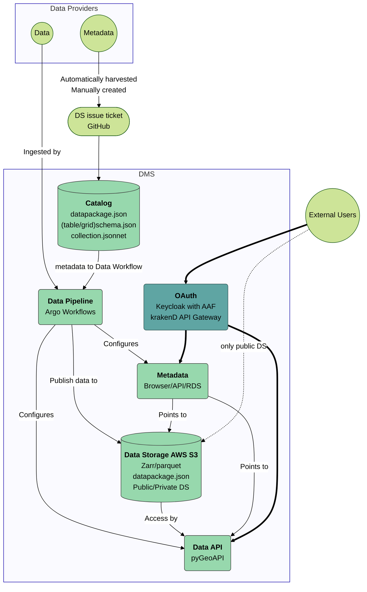

# Architecture

## Summary

- **Metadata API**: [stac-fastapi](https://github.com/stac-utils/stac-fastapi) implementation of [STAC API](https://stacspec.org/en)
  - [stac-browser](https://github.com/radiantearth/stac-browser) lightweight web-frontend
- **Data API**: [pygeoapi](https://github.com/geopython/pygeoapi/) implementation of [OGCAPIFeatures](https://ogcapi.ogc.org/features/) and [OGCAPICoverages](https://ogcapi.ogc.org/coverages/)
- **Data storage**: [zarr](https://zarr.readthedocs.io/en/stable/) and ([geo](https://geoparquet.org/))[parquet](https://parquet.apache.org/)
  - These analysis-ready cloud-optimised (ARCO) formats provide a method of direct data access
- **Metadata storage**: [Frictionless](https://specs.frictionlessdata.io/)
- **Data pipeline**: [Argo workflows](https://argoproj.github.io/workflows/)
- **Deployment**: AWS using[Terraform](https://www.terraform.io/), [Kubernetes](https://kubernetes.io/) and [Flux](https://fluxcd.io/)

## Components

- **[Infrastructure as Code (IaC)](./components/iac.md)**
  - External services + Cloud infrastructure + Kubernetes bootstrap: [`rimrep-terraform`](https://github.com/gbr-dms/rimrep-terraform)
  - GitOps: [`rimrep-flux`](https://github.com/gbr-dms/rimrep-flux)
- **[Observability](./components/observability.md)**
  - New Relic
  - Weave GitOps (front end for Flux)
- **[Metadata system](./components/metadata-system.md)**
  - Metadata entry tool: [`rimrep-metcalf`](https://github.com/gbr-dms/rimrep-metcalf)
  - Metadata API backend: [`rimrep-stac-fastapi`](https://github.com/gbr-dms/rimrep-stac-fastapi)
    - Storage: AWS RDS PostgreSQL
  - Metadata API frontend: [`rimrep-stac-browser`](https://github.com/gbr-dms/rimrep-stac-browser)
  - Metadata catalog point-of-truth: [`rimrep-catalog`](https://github.com/gbr-dms/rimrep-catalog)
- **[Data system](./components/data-system.md)**
  - Data storage: AWS S3
  - Data API backend (and simple frontend): [`rimrep-pygeoapi`](https://github.com/gbr-dms/rimrep-pygeoapi)
  - Data API auth: [`KrakenD API Gateway`](https://www.krakend.io/)
  - Direct access: AWS S3 or [`KrakenD API Gateway`](https://www.krakend.io/)
- **[Data pipeline](./components/data-pipeline.md)**
  - Argo Workflows ([`rimrep-flux`](https://github.com/gbr-dms/rimrep-flux))
  - Python modules: [`rimrep-data-pipeline`](https://github.com/gbr-dms/rimrep-data-pipeline)
- **[Auth](./components/auth.md)**
  - Okta for internal services
  - [Keycloak](https://www.keycloak.org) for external services
  - Authentication in front of services: [`oauth2proxy`](https://oauth2-proxy.github.io/oauth2-proxy/)
  - Authorization in front of data: [`KrakenD API Gateway`](https://www.krakend.io/)
- **[Admin dashboard](./components/admin-dashboard.md)**
  - Simple front-end: [`rimrep-dashboard`](https://github.com/gbr-dms/rimrep-dashboard)
  - Allows users copy their JWT identity token to clipboard.

## High level architecture

See also: https://miro.com/app/board/uXjVI8fb9rc=/
