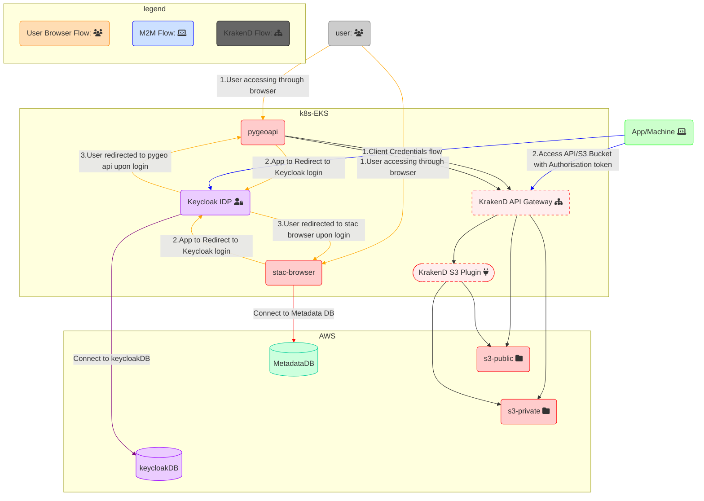
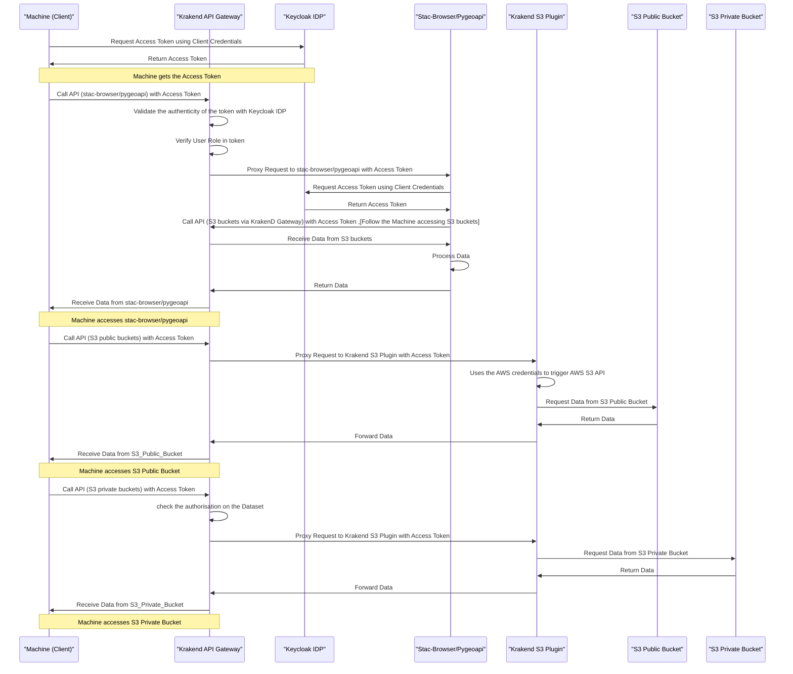
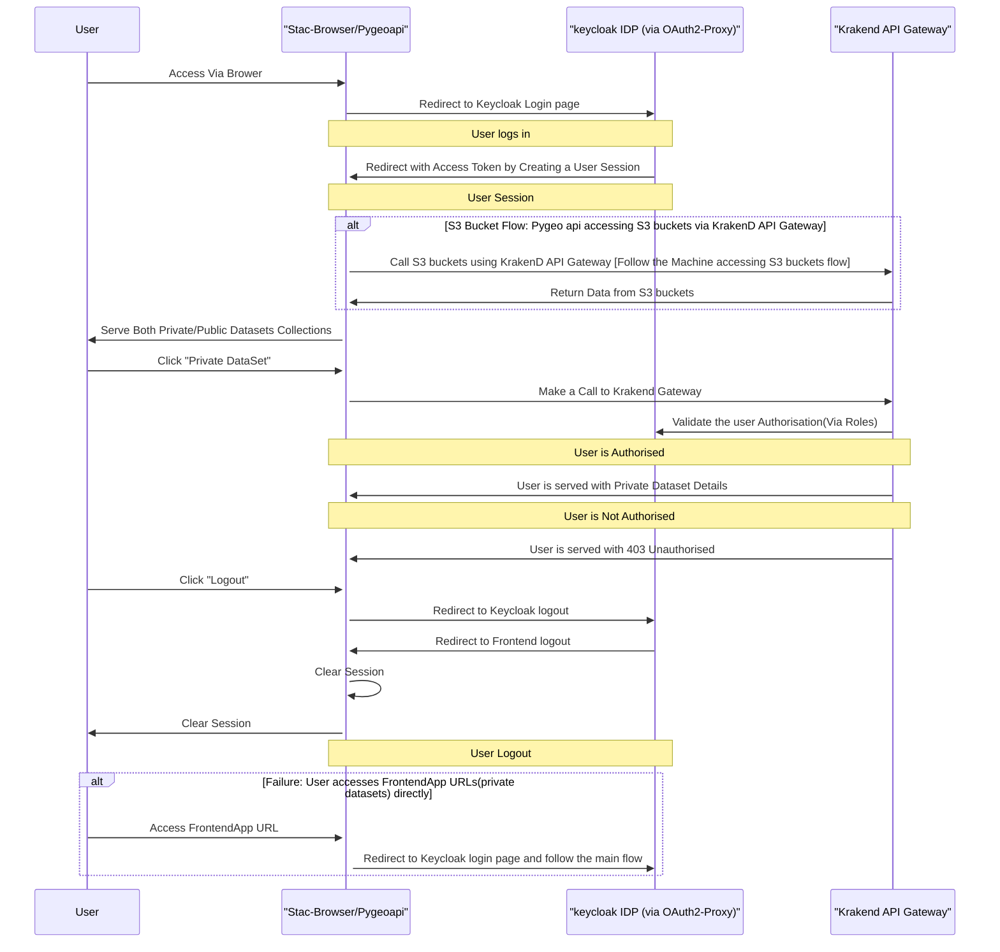

# Auth

## Summary

This document presents the Architecture for Authentication and Authorization flow for the following services:

- [`rimrep-pygeoapi`](https://github.com/gbr-dms/rimrep-pygeoapi) Data API
- [`rimrep-stac-fastapi`](https://github.com/gbr-dms/rimrep-stac-fastapi) Metadata API
- [`rimrep-stac-browser`](https://github.com/gbr-dms/rimrep-stac-browser) Metadata API Web Client
- S3-public buckets
- S3-private buckets

Additionally, it describes the sequence of interactions in two flows:

Machine-to-Machine (M2M) Flow: This flow demonstrates how a Machine (Client) can obtain an access token using the Client Credentials Grant and utilize it to call APIs via the Krakend API Gateway.

User Browser Flow: This flow showcases how a user's browser interacts with the Krakend API Gateway for authentication and authorization purposes.

The document provides insights into the steps and interactions involved in the mentioned flows, enabling a clear understanding of how the services handle authentication and authorization.

## Architecture 

### Machine to Machine Flow

### User Flow

### Keycloak

Keycloak (https://www.keycloak.org/) is a self-hosted and open-source identity provider (IDP) offering an excellent alternative to Auth0. It boasts fine-grained authorisation capabilities at various levels, allowing for precise access control. Role-based access control (RBAC) is supported for machine-to-machine (M2M) authorisation, granting granular permissions. As a widely adopted enterprise solution in the industry, Keycloak efficiently manages all users and their respective roles within the platform.

### KrakenD API Gateway

KrakenD (https://www.krakend.io/) is an open-source and flexible solution. Seamlessly integrating with cloud-native infrastructure, KrakenD can be easily deployed using an operator or Helm. Setting it apart from other popular choices like Kong or Tyk, KrakenD operates in a stateless manner, ensuring smooth scalability and reliability. With a wide range of features to optimize API management, such as rate limiting and robust request and response transformations, KrakenD empowers developers to deliver top-notch performance.

Furthermore, KrakenD simplifies authentication and authorization implementation by seamlessly integrating with OIDC providers like Auth0 or Keycloak, streamlining API protection. By connecting with Keycloak, KrakenD validates the Authorization token, and its configuration allows RBAC on the URLs (datasets) to apply filtering based on Keycloak roles. This enables precise control over access, providing enhanced security and functionality for your APIs.

### Krakend S3 Plugin

- [`rimrep-krakend-plugin`](https://github.com/gbr-dms/rimrep-krakend-plugin)  The KrakenD S3 Plug-in, written in GO, is seamlessly integrated into the base image of KrakenD. This powerful plug-in utilises AWS client credentials to directly interact with S3 buckets using the AWS S3 API, eliminating the need for any S3 proxy.

By combining the KrakenD S3 Plug-in with the KrakenD API Gateway, you can efficiently serve S3 bucket data with precise and fine-grained authorisation at the dataset level. This integration allows for secure and controlled access to specific datasets, ensuring enhanced security and data management for your S3 resources.

