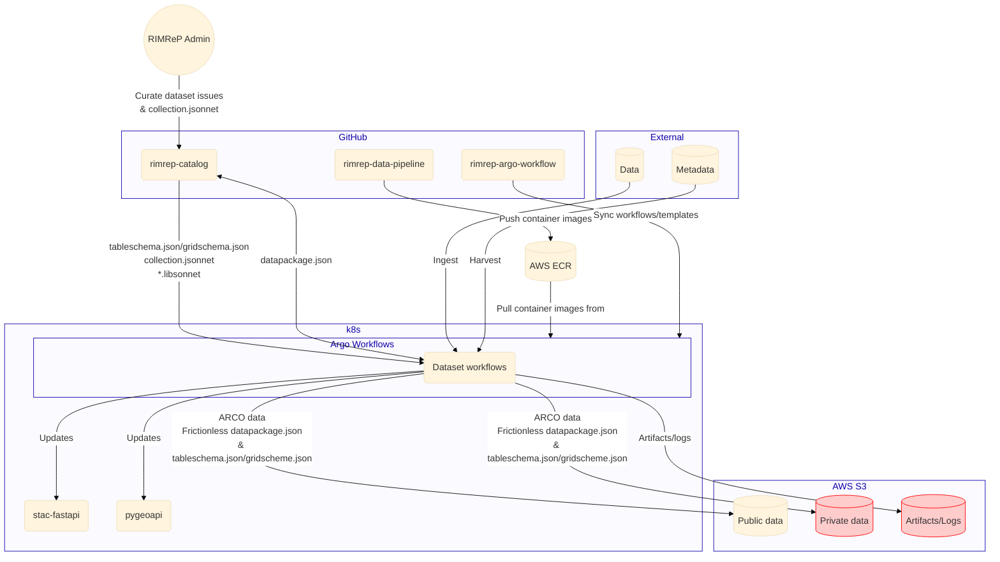

# Data pipeline

See [Data pipeline requirements](../../requirements.md#data-pipeline)

## Summary

- Argo Workflow
  - Workflows and templates are stored in the [`rimrep-argo-workflow`](https://github.com/aodn/rimrep-argo-workflow/tree/main/workflows) GitHub repository.
  - Workflows are synced in [`rimrep-flux`](https://github.com/aodn/rimrep-flux) GitHub repository.
  - Internal auth handled with Okta (maintained by AODN)
- Python modules and scripts: [`rimrep-data-pipeline`](https://github.com/aodn/rimrep-data-pipeline)
- For data storage and auth see [Data system architecture](data-system.md)

## Architecture

### High level architecture of the pipeline

### Argo Workflows

Kubernetes native workflow engine. Basically DAG of container jobs/steps.

Workflows and templates are stored in the [`rimrep-argo-workflow`](https://github.com/aodn/rimrep-argo-workflow/tree/main/workflows) GitHub repository.

Workflows are synced in [`rimrep-flux`](https://github.com/aodn/rimrep-flux) GitHub repository.

All temporary artifacts and logs are stored in an AWS S3 `rimrep-argowf-artifacts` bucket.

### Data pipeline repository

The [`rimrep-data-pipeline`](https://github.com/aodn/rimrep-data-pipeline) contains multiple Python modules and scripts that are used to process data and metadata. It publishes several docker container images to AWS ECR.

## Auth

Argo Workflows is for internal use only. Authentication is handled through AODN's Okta instance.
