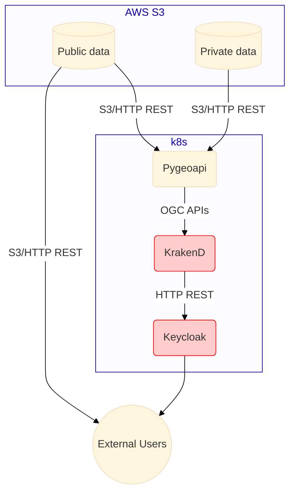

# Data system

See [Data API requirements](../../requirements.md#data-api)

## Summary

- Authentication [`Keycloak`](https://www.keycloak.org/) (See [auth architecture](auth.md))
- Data API backend (and simple frontend): [`rimrep-pygeoapi`](https://github.com/gbr-dms/rimrep-pygeoapi)
- Data API authorization: [`KrakenD`](https://www.krakend.io/)
- Direct access: AWS S3 or [`KrakenD`](https://www.krakend.io/)

## Architecture

### Data storage

All data is stored in AWS S3 in two buckets

- `gbr-dms-data-public` for public data
- `gbr-dms-data-limited-access` for limited access data
- See [data sensitivity classification](../../data/data-sensitivity.md) for more details
- The development environment uses buckets named `rimrep-data-public-development` and `rimrep-data-limited-access-development`

We support two data formats:

- zarr for multi-dimensional gridded numerical data
- parquet for tabular/vector data

### Data API

We are using [`rimrep-pygeoapi`](https://github.com/gbr-dms/rimrep-pygeoapi) (a fork of [`pygeoapi`](https://github.com/geopython/pygeoapi/)) to publish OGC APIs for data access.

This will publish [OGC API Features](https://ogcapi.ogc.org/features/) (from geo/parquet) and [OGC API Coverages](https://ogcapi.ogc.org/coverages/) (from zarr).

## Pygeoapi repository

Our version of `pygeoapi` is a fork of the main repository. We have made some changes to the codebase to support our requirements. This implies that we need to maintain our fork and keep it up to date with the main repository, and build our own images of pygeoapi to run. Pulling updates from the main repository should be done regularly to keep our fork up to date, but it is also a time-consuming process because we need to resolve conflicts and test the changes.

To mitigate this issue we have contributed a set of our changes back to the main repository, including the [parquet provider](https://github.com/geopython/pygeoapi/pull/1722) and [improvements to the zarr provider](https://github.com/geopython/pygeoapi/pull/1800). The last big change that we need added to the main repository is allowing different output formats for zarr data (we need to be able to serve the data as NetCDF). A [Pull Request](https://github.com/geopython/pygeoapi/pull/1830) has been created for this change, but it is still in review. Once this change is merged, we should be able to use the main repository without any modifications. When this happens, the following changes will need to be done to simplify our architecture:

- Use the `geopython/pygeoapi` docker image instead of our self-built image
- Test the new image to ensure that it works as expected
- Remove our forked repository

The `latest` version of the image could be used to avoid the need to update the image manually, but this could also introduce breaking changes as this tag tracks the development version of pygeoapi. To avoid this, we should use a specific released version of the image and update it manually whenever a new version is released (for example, at the moment of writing this text the [latest released version](https://hub.docker.com/r/geopython/pygeoapi/tags) is [`geopython/pygeoapi:0.18.0`](https://hub.docker.com/layers/geopython/pygeoapi/0.18.0/images/sha256-c329c4332bce056ffb850210a3ca642fabc1362efc6282f8ec1ceeeceb332994?context=explore)). This will allow us to test the changes before deploying them to the production environment. The manual update process will however be considerably easier, as it will only require changing the version of the image in the deployment configuration.

## Pygeoapi configuration files

Pygeoapi needs [a yaml configuration file](https://docs.pygeoapi.io/en/latest/configuration.html) containing some information about our catalog together with some metadata for each dataset to be published. Part of this information is generated automatically in argo workflows during the ingestion of new data.
As a support to generate these files, both workflows and pygeoapi have access to a `pygeoapi` folder in the s3 data buckets (`rimrep-data-public-development` for development and `gbr-dms-data-public` for production).
This folder contains the following objects:

- `header.yaml`: static, human-curated configuration for pygeoapi, including contact information for the provider. This is the only file that could need manual changes. It could be a good idea to eventually move it to a github repository.
- `datasets`: a folder containing a separate file for each dataset, created automatically by the ingestion workflows
- `config-pygeoapi.yaml`: the automatically generated configuration file combining the previous two items
- `config-openapi.yaml`: documentation for the openapi interface provided by pygeoapi, visible as [a swagger document](https://pygeoapi.reefdata.io/openapi) on the deployed platform

## Auth

See [Auth architecture](auth.md) documentation for more detailed information.

Currently, `pygeoapi` requires authentication for all datasets. Access to limited-access datasets requires authorization through KrakenD.

Public data is in the `gbr-dms-data-public` S3 bucket and is accessible to all users without authentication (directly to AWS S3). Limited access data is in the `gbr-dms-data-limited-access` S3 bucket and is only accessible to authorized users through [`KrakenD`](https://www.krakend.io/). This applies to both "direct access" and "data API" access.

- Direct access: [`KrakenD`](https://www.krakend.io/) is used to proxy requests to the private S3 bucket.
- Data API access: `pygeoapi` can access the `gbr-dms-data-limited-access` bucket directly (through S3), and it does not have authorization built in. Users accessing Pygeoapi need to be authenticated via [`Keycloak`](https://www.keycloak.org/), and their connection will go through [`KrakenD`](https://www.krakend.io/), which manages authorization.
