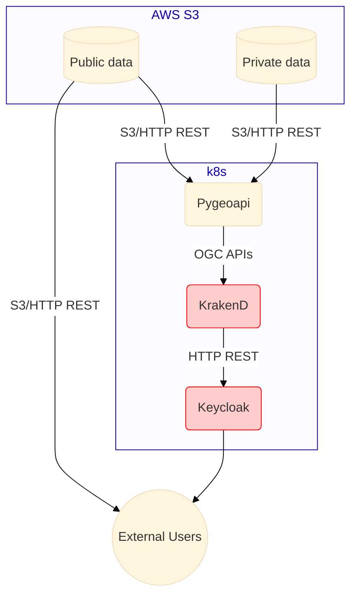

# Data system

See [Data API requirements](../../requirements.md#data-api)

## Summary

- Authentication [`Keycloak`](https://www.keycloak.org/) (See [auth architecture](auth.md))
- Data API backend (and simple frontend): [`rimrep-pygeoapi`](https://github.com/aodn/rimrep-pygeoapi)
- Data API authorization: [`KrakenD`](https://www.krakend.io/)
- Direct access: AWS S3 or [`KrakenD`](https://www.krakend.io/)

## Architecture

### Data storage

All data is stored in AWS S3 in two buckets

- `gbr-dms-data-public` for public data
- `gbr-dms-data-limited-access` for limited access data
- See [data sensitivity classification](../../data/data-sensitivity.md) for more details
- The development environment uses buckets named `rimrep-data-public-development` and `rimrep-data-limited-access-development`

We support two data formats:

- zarr for multi-dimensional gridded numerical data
- parquet for tabular/vector data

### Data API

We are using [`rimrep-pygeoapi`](https://github.com/aodn/rimrep-pygeoapi) (a fork of [`pygeoapi`](https://github.com/geopython/pygeoapi/)) to publish OGC APIs for data access.

This will publish [OGC API Features](https://ogcapi.ogc.org/features/) (from geo/parquet) and [OGC API Coverages](https://ogcapi.ogc.org/coverages/) (from zarr).

## Auth

See [Auth architecture](auth.md) documentation for more detailed information.

Currently, `pygeoapi` requires authentication for all datasets. Access to limited-access datasets requires authorization through KrakenD.

Public data is in the `gbr-dms-data-public` S3 bucket and is accessible to all users without authentication (directly to AWS S3). Limited access data is in the `gbr-dms-data-limited-access` S3 bucket and is only accessible to authorized users through [`KrakenD`](https://www.krakend.io/). This applies to both "direct access" and "data API" access.

- Direct access: [`KrakenD`](https://www.krakend.io/) is used to proxy requests to the private S3 bucket.
- Data API access: `pygeoapi` can access the `gbr-dms-data-limited-access` bucket directly (through S3), and it does not have authorization built in. Users accessing Pygeoapi need to be authenticated via [`Keycloak`](https://www.keycloak.org/), and their connection will go through [`KrakenD`](https://www.krakend.io/), which manages authorization.
