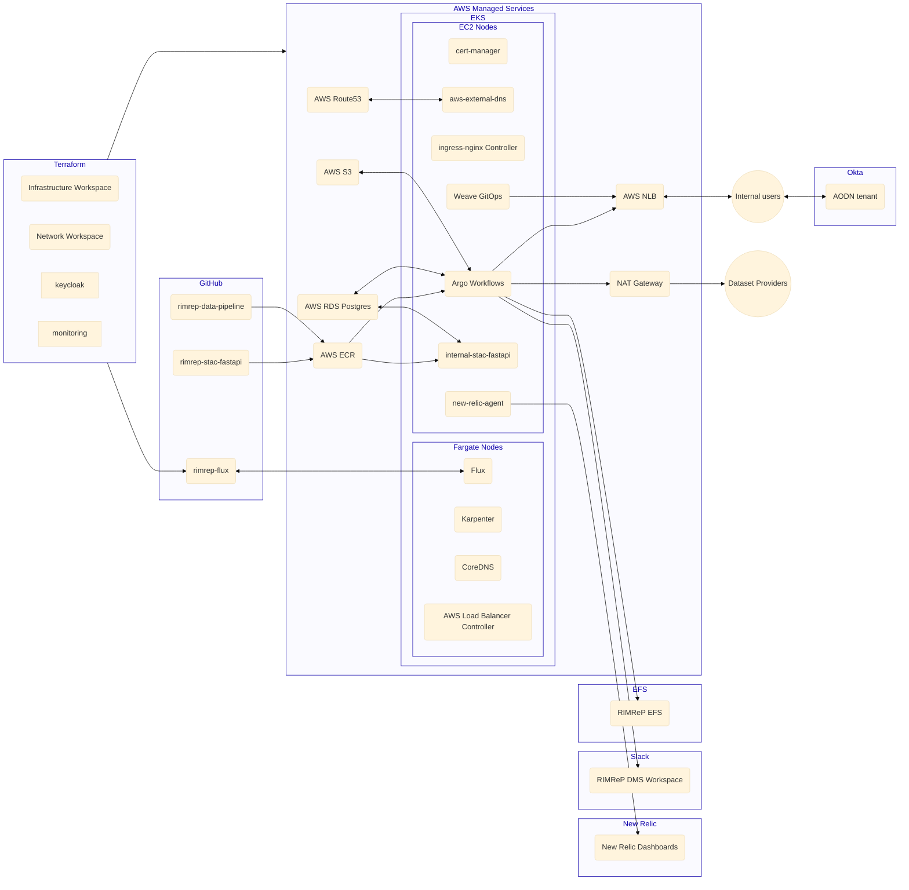
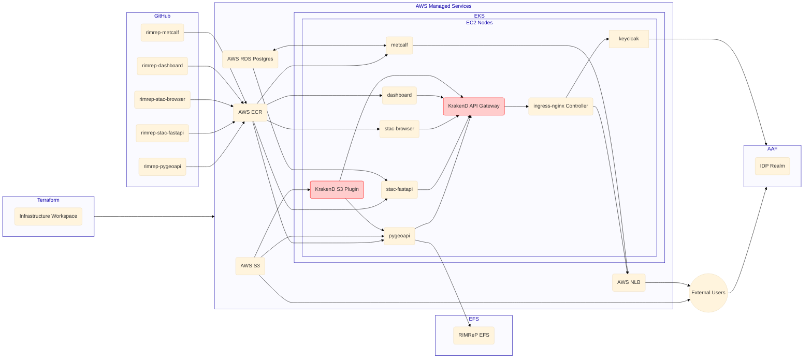

# Infrastructure as Code

## Overview

The infrastructure setup leverages Infrastructure as Code (IaC) to deploy and manage AWS Virtual Private Cloud (VPC) with Elastic Kubernetes Service (EKS). The architecture ensures seamless integration of various services and dependencies, allowing for scalable, secure, and efficient management of resources. This documentation provides an in-depth explanation of the components and their interactions as depicted in the architecture diagrams.

- External services + Cloud infrastructure + Kubernetes bootstrap: [`rimrep-terraform`](https://github.com/aodn/rimrep-terraform)
- GitOps: [`rimrep-flux`](https://github.com/aodn/rimrep-flux)

## Cluster Overview

### Terraform Workspaces

The infrastructure is managed through Terraform workspaces:
- **Infrastructure Workspace**: Manages core infrastructure components.
- **Network Workspace**: Manages networking components like VPC, subnets, and NAT gateways.
- **Keycloak Workspace**: Manages the keycloak auth service
- **Monitoring Workspace**: Manages the New Relic monitoring and alerts

### AWS Managed Services

Several AWS Managed Services are utilized:
- **AWS Route53**: For DNS management.
- **AWS NLB (Network Load Balancer)**: Distributes incoming application traffic.
- **NAT Gateway**: Facilitates outbound internet traffic for instances in private subnets.
- **AWS RDS Postgres**: Managed PostgreSQL databases.
- **AWS S3**: Object storage service.
- **AWS ECR (Elastic Container Registry)**: Stores Docker container images.

### EKS Cluster

The EKS cluster consists of Fargate and EC2 nodes, hosting various services:
- **Fargate Nodes**: Runs Flux, Karpenter, CoreDNS, and AWS Load Balancer Controller.
- **EC2 Nodes**: Hosts cert-manager, AWS External DNS, ingress-nginx Controller, Argo Workflows, Weave GitOps, internal-stac-fastapi, and New Relic agent.

### External Services

- **New Relic**: For monitoring and performance management.
- **Slack**: For notifications and alerts.

### Workflow

1. **Terraform** provisions the AWS resources and configures the EKS cluster.
2. **GitHub repositories** are used for storing and managing application code and configurations.
3. **ECR** stores container images, which are deployed to the EKS cluster.
4. **Route53** manages DNS records, integrating with AWS External DNS.
5. **NAT Gateway** allows dataset providers to access necessary resources.
6. **RDS** and **S3** provide storage solutions for applications running in the cluster.
7. **Argo Workflows** orchestrates complex workflows, interfacing with RDS, S3, and EFS.
8. **New Relic** monitors application performance, sending alerts to **Slack**.

## External Services

### Terraform Workspace

- **Infrastructure Workspace**: Manages the deployment and configuration of external services.

### AWS Managed Services

- **AWS NLB (Network Load Balancer)**: Routes traffic to Keycloak and Metcalf services.
- **AWS RDS Postgres**: Database for stac-fastapi and Metcalf.
- **AWS S3**: Provides storage for data accessed by S3 Proxy and PygeoAPI.
- **AWS ECR**: Stores Docker images for the external services.

### EKS Cluster

The EKS cluster hosts multiple services on EC2 nodes:
- **PygeoAPI**
- **S3 Proxy** (critical service)
- **Keycloak** (critical service)
- **stac-fastapi**
- **stac-browser**
- **Dashboard**
- **Metcalf**

### GitHub Repositories

Code repositories for external services:
- **rimrep-pygeoapi**
- **rimrep-stac-fastapi**
- **rimrep-stac-browser**
- **rimrep-dashboard**
- **rimrep-metcalf**

### Workflow

1. **Terraform** provisions the infrastructure for external services.
2. **GitHub repositories** store and manage the service code.
3. **ECR** stores container images, which are deployed to EKS.
4. **S3** provides storage for data accessed by the services.
5. **RDS** serves as the database backend for stac-fastapi and Metcalf.
6. **Load Balancer** routes traffic to Keycloak and Metcalf services.
7. **EFS** provides file storage for PygeoAPI.

This setup ensures a scalable and manageable infrastructure for deploying and running applications on AWS, leveraging the power of EKS and various AWS managed services. The integration with GitHub, New Relic, and Slack enhances the development workflow, monitoring, and alerting capabilities.

## Terraform Modules and Environments

### Terraform Modules

The Terraform modules used for this infrastructure are stored in the `gbr-dms-terraform-modules` repository. Updates to this repository are merged into the main branch and tagged with a new version, e.g., `v0.1.0`, `v0.2.0`. In the `rimrep-terraform` repository, module sources are declared like so:

```hcl
source  = "git@github.com:aodn/gbr-dms-terraform-modules.git//modules/eks?ref=0.1.0"
```

### Environments

The `rimrep-terraform` repository contains two environments: one for `development` and one for `production`. New updates and module versions are first tested in the development environment and then applied to the production environment.

### Change Management Workflow

1. **Develop and Test**: Changes are made to the `gbr-dms-terraform-modules` repository. After merging changes into the main branch, a new version tag is created.
2. **Update Module Source**: In the `rimrep-terraform` repository, update the module source reference to the new version tag in the development environment.
3. **Apply to Development**: Run `terraform apply` in the development environment to test the changes.
4. **Validate**: Ensure the changes work as expected in the development environment.
5. **Promote to Production**: Once validated, update the module source reference in the production environment to the new version tag.
6. **Apply to Production**: Run `terraform apply` in the production environment to deploy the changes.

This process ensures that all updates are thoroughly tested before being deployed to the production environment, maintaining stability and reliability.

## KrakenD API Gateway

The KrakenD API Gateway is deployed within the EKS cluster to manage and route API requests. It integrates with various backend services to provide a unified API endpoint for external users.

### Components

- **KrakenD S3 Plugin**: Integrates with AWS S3 for efficient data access.
- **KrakenD API Gateway**: Routes API requests to appropriate backend services.

### Workflow

1. **KrakenD API Gateway** receives API requests from external users.
2. Requests are routed to backend services such as **PygeoAPI**, **stac-fastapi**, and **Dashboard**.
3. **KrakenD S3 Plugin** provides efficient data access from AWS S3.

## NGINX Ingress Controller

The NGINX Ingress Controller manages incoming HTTP and HTTPS traffic, providing load balancing, SSL termination, and name-based virtual hosting for the services within the EKS cluster.

### Workflow

1. **NGINX Ingress Controller** receives incoming traffic through the AWS NLB.
2. Traffic is routed to the appropriate service, such as **Keycloak** or **Metcalf**.
3. The Ingress Controller ensures secure and efficient traffic management.

## AAF IDP Integration

Keycloak is integrated with the AAF IDP (Identity Provider) to provide federated authentication and authorization for external users.

### Components

- **AAF IDP Realm**: Manages user identities and authentication.
- **Keycloak**: Provides federated identity management and single sign-on (SSO) capabilities.

### Workflow

1. **External Users** authenticate via the **AAF IDP Realm**.
2. **Keycloak** processes the authentication and provides SSO capabilities for accessing various services within the EKS cluster.


## Cluster overview



## External Services


