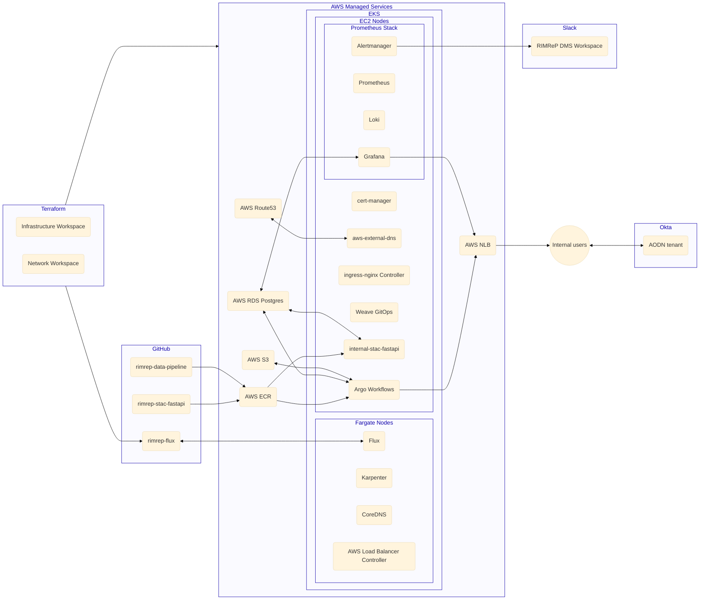
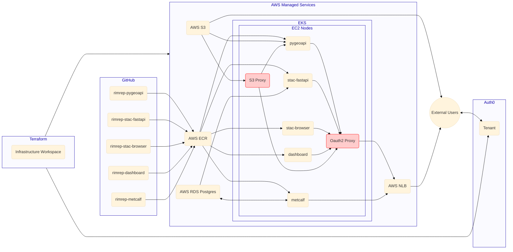

# Infrastructure as Code

WIP

## Summary

- External services + Cloud infrastructure + Kubernetes bootstrap: [`rimrep-terraform`](https://github.com/aodn/rimrep-terraform)
- GitOps: [`rimrep-flux`](https://github.com/aodn/rimrep-flux)

## Cluster overview

### Internal Services

See [Internal tools and services](./../../internal/internal-tools-and-services.md)

## External Services

