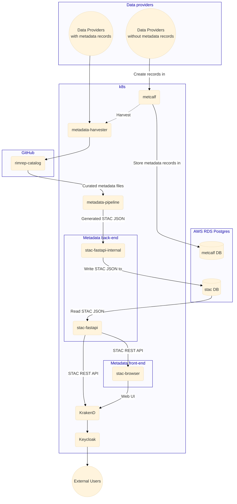
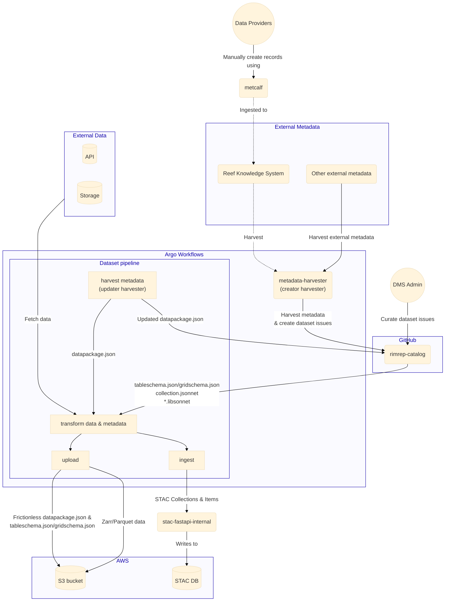
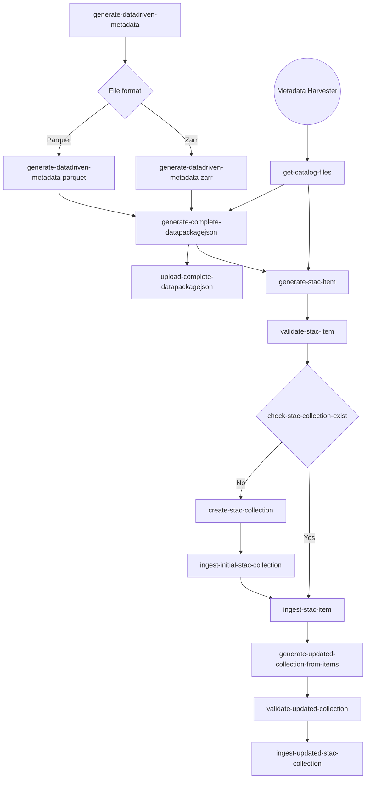
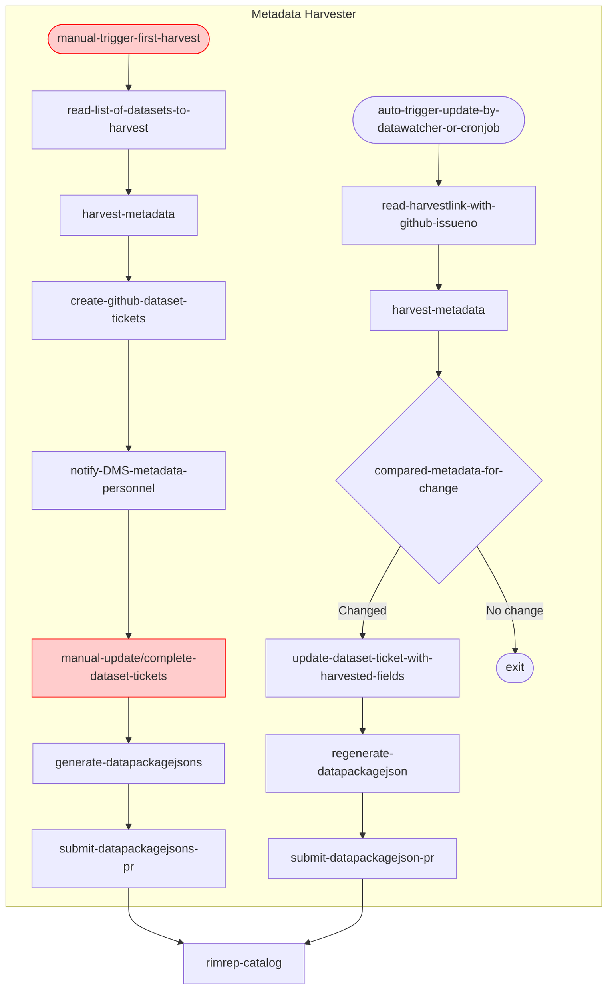

# Metadata system

The metadata system serves as a comprehensive framework for organizing and managing datasets, facilitating efficient data discovery. The system follows the [STAC (SpatioTemporal Asset Catalogs) specification](https://stacspec.org/en) which provides a standardized way to expose collections of spatial temporal data. The metadata system comprises three core components: the API back-end [`stac-fastapi`](https://stac.reefdata.io/), the API front-end [`stac-browser`](https://stac.reefdata.io/browser), and the metadata catalog point-of-truth repository [`rimrep-catalog`](https://github.com/aodn/rimrep-catalog). The API back-end `stac-fastapi` enables dataset discovery via a REST API, while the front-end, `stac-browser`, offers a web-based interface for users to search datasets using various filters such as dataset name, data provider, keywords, date range, and spatial extents. The metadata catalog repository, `rimrep-catalog`, serves as a version-controlled repository to store all the metadata catalog files, including `frictionless` metadata files, accessed by automated pipelines to update the data and metadata in the DMS. Additionally, a [metadata entry tool](https://met.reefdata.io/) is provided as a temporary solution to create metadata records for datasets lacking existing metadata records.

## Summary

- Authentication: [`Keycloak`](https://www.keycloak.org/) (See [auth architecture](auth.md))
- Authorization: [`KrakenD`](https://www.krakend.io/) (See [auth architecture](auth.md))
- Metadata API back-end: [`rimrep-stac-fastapi`](https://github.com/aodn/rimrep-stac-fastapi)
  - [`pgstac`](https://github.com/stac-utils/pgstac) back-end - with AWS RDS PostgreSQL instance
- Metadata API front-end: [`rimrep-stac-browser`](https://github.com/aodn/rimrep-stac-browser)
- Metadata entry tool: [`rimrep-metcalf`](https://github.com/aodn/rimrep-metcalf)
  - Temporary tool to create metadata records to be ingested into external metadata management systems
  - Not integrated into any other components
- Metadata catalog point-of-truth: [`rimrep-catalog`](https://github.com/aodn/rimrep-catalog)
  - Version controlled - GitHub repository
  - Stores the templates, specification documents and human-curated metadata files for the automated metadata pipelines
    - Manually curated metadata files for STAC Collections (collection.jsonnet)
    - Manually curated metadata files for STAC Items using [`frictionless`](https://specs.frictionlessdata.io/) framework (datapackage.json, tableschema.json, gridschema.json)
    - Jsonnet library files to help with metadata manipulation in the automated metadata pipelines
    - Documentation for the STAC specification and guidelines we use
    - Files containing lists of datasets for metadata harvester to harvest
  - Automated publishing to [`rimrep-stac-fastapi`](https://github.com/aodn/rimrep-stac-fastapi)
- Complete [`frictionless`](https://specs.frictionlessdata.io/) metadata files generated by automated metadata pipelines are stored on S3 together with the data for users to access.
- Metadata harvester: metadata harvester comprises a series of Argo Workflows that need be triggered manually or run automatically to simplify the metadata harvesting process.

## Architecture

_(Note: Dashed line = not implemented yet)_

### Metadata flow 

_(Note: Dashed line = not implemented yet)_

### Metadata pipeline

Flowchart of the detailed steps in the metadata pipeline.

_(The detailed steps for metadata harvester is illustrated further in the [metadata harvester flowchart](#metadata-harvester-flowchart))_

### Metadata harvester flowchart

_(Note: red color means the step is manual)_

### Metadata API back-end

We are using [`rimrep-stac-fastapi`](https://github.com/aodn/rimrep-stac-fastapi) (a fork of [`stac-fastapi`](https://github.com/stac-utils/stac-fastapi)) to publish STAC API. It is using the [`pgstac`](https://github.com/stac-utils/pgstac) back-end with an AWS RDS PostgreSQL instance.

Note: there are two deployments, one is called `stac-fastapi-internal`, it has read/write access and is only accessible from within the k8s cluster. The other is called `stac-fastapi`, it only has read access and is accessible from outside the k8s cluster.

### Metadata API front-end

We are using [`rimrep-stac-browser`](https://github.com/aodn/rimrep-stac-browser) (a fork of [`stac-browser`](https://github.com/radiantearth/stac-browser)), which provides a simple Web UI to browse STAC API.

### Metadata entry tool

We are using [`rimrep-metcalf`](https://github.com/aodn/rimrep-metcalf) to provide a Web UI for data providers to use to create metadata records.

This component is temporary, it is only used by data providers that don't have metadata records in an external metadata management system. The goal is to ingest all created metadata records into an external metadata management system by the end of this phase of the project.

We will temporarily use records created by metcalf until they have been ingested into an external metadata management system.

### Metadata catalog point-of-truth

GitHub repository - https://github.com/aodn/rimrep-catalog - using [`jsonnet`](https://jsonnet.org/) JSON template language.

The publishing of STAC Collections and Items to `stac-fastapi-internal` has been automated in the metadata pipeline.

### Public Frictionless metadata files

Published as [Frictionless Datapackage](https://specs.frictionlessdata.io/data-package/) json files in the same folder as the data. The basic datapackage structure has been extended and specialised for the GBR DMS and a [Profile](https://specs.frictionlessdata.io/profiles/) describing it (as a json schema) is available on github [`rimrep-catalog`](https://github.com/aodn/rimrep-catalog/blob/main/templates/gbr-dms-data-package.json) for version control and at `s3://gbr-dms-files-public/gbr-dms-data-package.json` for public access.

Datapackage files are generated by ingestion workflows as a combination of human-curated metadata from [`rimrep-catalog`](https://github.com/aodn/rimrep-catalog) and data-driven metadata extracted from the data itself by the scripts in [`rimrep-data-pipeline`](https://github.com/aodn/rimrep-data-pipeline/tree/main/reefdata_stac/reefdata_stac). 

Tabular datasets are also associated with a [Tableschema](https://specs.frictionlessdata.io/table-schema/) file listing the names and types of all columns in the dataset. Gridded datasets use a `Gridschema` file instead, which has been designed on purpose for this system following the specifications of both [Frictionless schema](https://specs.frictionlessdata.io/data-resource/#resource-schemas) and [Stac datacube](https://github.com/stac-extensions/datacube).

The generated datapackage files act as a central repository of all known information about each dataset, and STAC items and pygeoapi configuration entries are generated programmatically based exclusively on these files.

### Metadata harvester

For new datasets that exist in external metadata catalogs, we manually trigger the metadata harvester to harvest them in bulk. The harvester will collect the metadata and create dataset issues in the `rimrep-catalog` GitHub repository to capture the harvested information. These dataset tickets need to be reviewed by the metadata personnel in the team to double-check the information and fill in any missing data. Following this, an Argo Workflow template named `bulk-generate-datapkg-and-submit` can be called to generate the `datapackage.json` files in bulk for the new dataset issues and submit them to `rimrep-catalog`.

For existing datasets in the DMS, the metadata harvester runs automatically (either attached to a data-watcher or as a cronjob) to periodically check whether the original metadata has been updated. If an update of the fields that we are interested in has been detected, the metadata harvester will collect the new data and update the GitHub dataset issue. Subsequently, it will automatically regenerate the `datapackage.json` file and submit to `rimrep-catalog` for review.  

## Auth

See [authentication](auth.md) component documentation.

Currently, the `stac-fastapi` and `stac-browser` requires authentication for all STAC collections/items. Authorization is required for limited access STAC collections/items through `KrakenD`.
