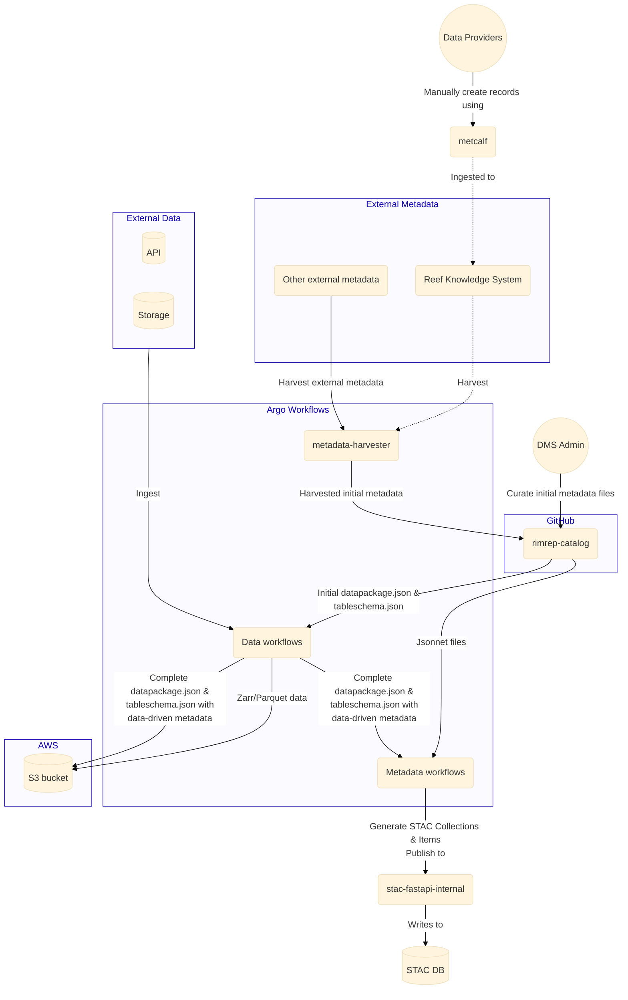

# Metadata system

## Summary

- Authentication: [`Keycloak`](https://www.keycloak.org/) (See [auth architecture](auth.md))
- Authorization: [`KrakenD`](https://www.krakend.io/) (See [auth architecture](auth.md))
- Metadata API back-end: [`rimrep-stac-fastapi`](https://github.com/aodn/rimrep-stac-fastapi)
  - [`pgstac`](https://github.com/stac-utils/pgstac) back-end - with AWS RDS PostgreSQL instance
- Metadata API front-end: [`rimrep-stac-browser`](https://github.com/aodn/rimrep-stac-browser)
- Metadata entry tool: [`rimrep-metcalf`](https://github.com/aodn/rimrep-metcalf)
  - Temporary tool to create metadata records to be ingested into external metadata management systems
  - Not integrated into any other components
- Metadata catalog point-of-truth: [`rimrep-catalog`](https://github.com/aodn/rimrep-catalog)
  - Version controlled - GitHub repository
  - Stores the templates, specification documents and human-curated metadata files for the automated metadata pipelines
    - Manually curated metadata files for STAC Collections (collection.jsonnet)
    - Manually curated metadata files for STAC Items using [`frictionless`](https://specs.frictionlessdata.io/) framework (datapackage.json, tableschema.json)
    - Jsonnet library files to help with metadata manipulation in the automated metadata pipelines
    - Documentation for the STAC specification and guidelines we use
    - Files containing lists of datasets for metadata harvester to harvest
  - Automated publishing to [`rimrep-stac-fastapi`](https://github.com/aodn/rimrep-stac-fastapi)
- Complete [`frictionless`](https://specs.frictionlessdata.io/) metadata files generated by automated metadata pipelines are stored on S3 together with the data for users to access.

## Architecture

_(Note: Dashed line = not implemented yet)_

### Metadata flow 

_(Note: Dashed line = not implemented yet)_

### Metadata API back-end

See [Metadata API requirements](../../requirements.md#metadata-api)

We are using [`rimrep-stac-fastapi`](https://github.com/aodn/rimrep-stac-fastapi) (a fork of [`stac-fastapi`](https://github.com/stac-utils/stac-fastapi)) to publish STAC API. It is using the [`pgstac`](https://github.com/stac-utils/pgstac) back-end with an AWS RDS PostgreSQL instance.

Note: there are two deployments, one is called `internal-stac-fastapi`, it has read/write access and is only accessible from within the k8s cluster. The other is called `stac-fastapi`, it only has read access and is accessible from outside the k8s cluster.

### Metadata API front-end

We are using [`rimrep-stac-browser`](https://github.com/aodn/rimrep-stac-browser) (a fork of [`stac-browser`](https://github.com/radiantearth/stac-browser)), which provides a simple Web UI to browse STAC API.

### Metadata entry tool

See [Metadata entry tool requirements](../../requirements.md#metadata-entry-tool-met)

We are using [`rimrep-metcalf`](https://github.com/aodn/rimrep-metcalf) to provide a Web UI for data providers to use to create metadata records.

This component is temporary, it is only used by data providers that don't have metadata records in an external metadata management system. The goal is to ingest all created metadata records into an external metadata management system by the end of this phase of the project.

We will temporarily use records created by metcalf until they have been ingested into an external metadata management system.

### Metadata catalog point-of-truth

GitHub repository - https://github.com/aodn/rimrep-catalog - using [`jsonnet`](https://jsonnet.org/) JSON template language.

In the future, we will automate the publishing of STAC Collections and Items to `stac-fastapi`.

### Public metadata files

Published as [Frictionless Datapackage](https://specs.frictionlessdata.io/data-package/) json files in the same folder as the data. The basic datapackage structure has been extended and specialised for the GBR DMS and a [Profile](https://specs.frictionlessdata.io/profiles/) describing it (as a json schema) is available on github [`rimrep-catalog`](https://github.com/aodn/rimrep-catalog/blob/main/templates/gbr-dms-data-package.json) for version control and at `s3://gbr-dms-files-public/gbr-dms-data-package.json` for public access.

Datapackage files are generated by ingestion workflows as a combination of human-curated metadata from [`rimrep-catalog`](https://github.com/aodn/rimrep-catalog) and data-driven metadata extracted from the data itself by the scripts in [`rimrep-data-pipeline`](https://github.com/aodn/rimrep-data-pipeline/tree/main/reefdata_stac/reefdata_stac). 

Tabular datasets are also associated with a [Tableschema](https://specs.frictionlessdata.io/table-schema/) file listing the names and types of all columns in the dataset.

The generated datapackage files act as a central repository of all known information about each dataset, and STAC items and pygeoapi configuration entries are generated programmatically based exclusively on these files.

## Auth

See [authentication](auth.md) component documentation.

Currently, the `stac-fastapi` and `stac-browser` requires authentication for all STAC collections/items. In the future, open access by default, and require authorization for limited access STAC collections/items.

Authorization will be handled inside `stac-fastapi`.
