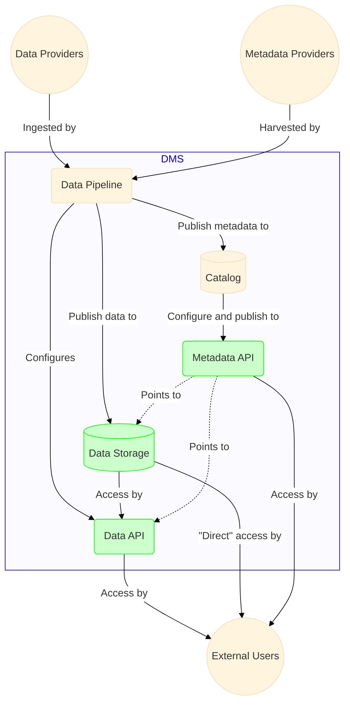
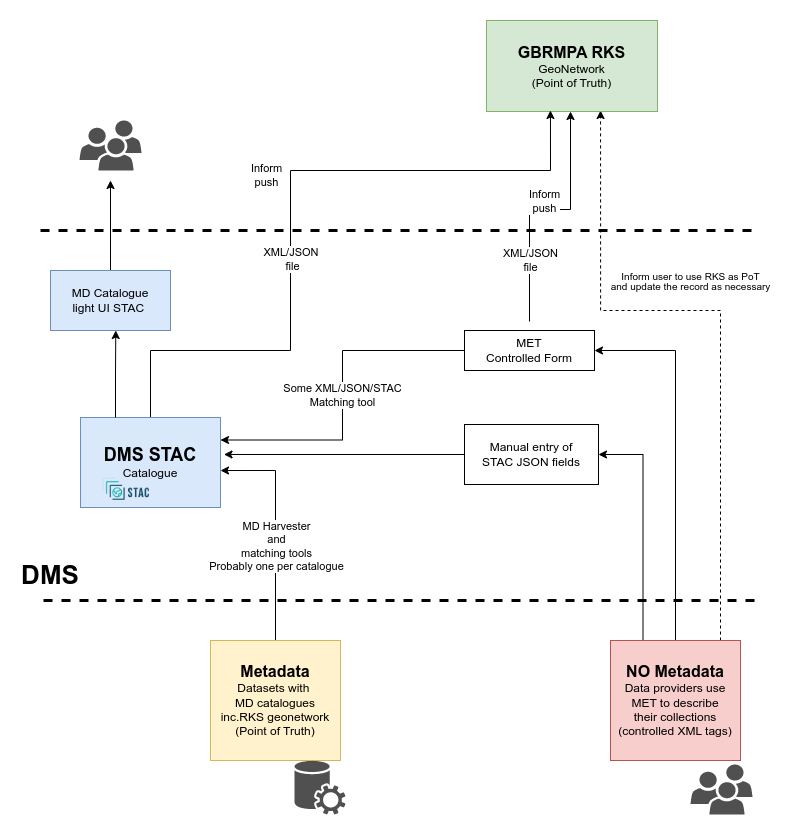

# Previous architecture diagrams

## DMS December 2023

Before Keycloak/KrakenD and Frictionless were incorporated into the system 

## RIMReP DMS Phase 1

From [RIMReP DMS Phase 1 Report - Scoping Assessment (May 2022)](https://universitytasmania.sharepoint.com/sites/RIMRePDMS/Shared%20Documents/Forms/AllItems.aspx?ga=1&id=%2Fsites%2FRIMRePDMS%2FShared%20Documents%2FDocs%2FDMS%20%2D%20Phase1%2FRIMReP%5FDMS%2Dphase1%5FReport%5FFINAL%2Epdf&viewid=0566ab7b%2Def7e%2D4348%2Db059%2Dfff671d97956&parent=%2Fsites%2FRIMRePDMS%2FShared%20Documents%2FDocs%2FDMS%20%2D%20Phase1) talk to @diodon for access

## RIMReP DMS Phase 2 - Townsville meeting

From [Minutes RIMReP meeting in Townsville 4 August 2022](https://universitytasmania.sharepoint.com/sites/RIMRePDMS/Shared%20Documents/Forms/AllItems.aspx?ga=1&id=%2Fsites%2FRIMRePDMS%2FShared%20Documents%2FGeneral%2FMeeting%5Fnotes%2FMinutes%20RIMReP%20meeting%20in%20Townsville%204%20August%202022%2Epdf&viewid=0566ab7b%2Def7e%2D4348%2Db059%2Dfff671d97956&parent=%2Fsites%2FRIMRePDMS%2FShared%20Documents%2FGeneral%2FMeeting%5Fnotes) talk to @diodon for access

## Metadata flow

