## Secrets Rotation
Secrets rotation is a critical aspect of maintaining security in software systems. It involves periodically changing sensitive information like passwords, encryption keys, API tokens, etc., to reduce the risk of unauthorized access. Although the specific steps for secrets rotation can vary based on the systems and tools used, here are some general guidelines:

- Identify secrets: Document and gather all the sensitive credentials and information that need regular rotation. This includes passwords, API keys, database credentials, encryption keys, certificates, etc.

- Define Rotation Frequency: Determine how frequently each type of secret needs to be rotated. High-security secrets might require more frequent rotations, while others might be less frequent.

- Automate Rotation Processes: Whenever possible, automate the rotation process to minimize human intervention and errors. Use tools or scripts to update credentials systematically.

- Test Rotated Secrets: After rotation, test the updated credentials to ensure they work correctly within the system without causing disruptions.

- Update Documentation: Maintain clear and updated documentation regarding the rotation schedule, procedures, and any changes made. This ensures that all team members are aware of the process.

- Manage Access Control: During the rotation process, ensure that only authorized personnel have access to the new credentials and that old credentials are properly revoked or disabled.

- Audit and Monitoring: Implement regular audits and monitoring to track when secrets were rotated, who accessed them, and any unusual activities related to secret management.

- Communication: Maintain open communication within the team regarding any upcoming rotations, changes in credentials, or potential impacts on system functionality.

- Continuous Improvement: Regularly review the secrets rotation process to identify areas for improvement and adapt to evolving security threats.

- Compliance and Regulations: Ensure that the secrets rotation process complies with relevant industry standards and regulations (e.g., GDPR, HIPAA) if applicable to your system.

### Keycloak Admin Credentials Rotation
- Login to [`keycloak portal`](https://keycloak.staging-v2.reefdata.io/admin/master/console/#/master/users/efab046b-dcba-4856-b5a4-3bc871af0ce1/credentials) for credentials rotation

- Under Realm master-->Users-->Click admin user

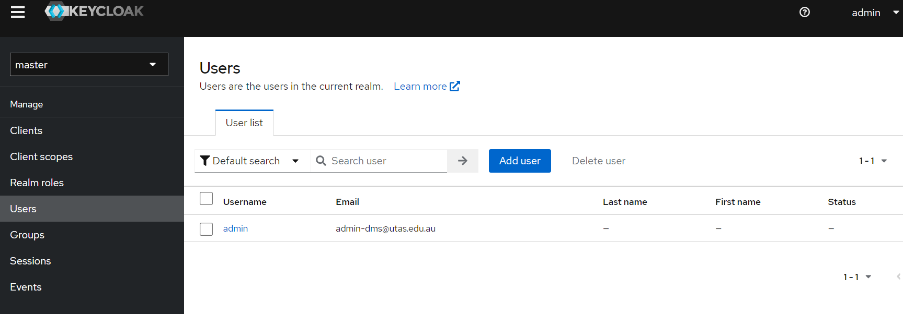

- Select tab Credentials-->Click Reset password

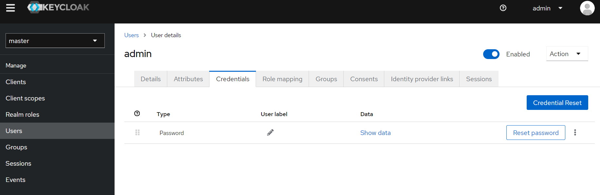

- Once the admin password is reset copy and store in AWS Secrets Manager [Secrets Manual Rotation](#secrets-manual-rotation)

### Keycloak Client ID/Client Secrets Rotation
- Login to [`keycloak portal`](https://keycloak.staging-v2.reefdata.io/admin/master/console/#/rimrep-staging-v2/clients/7345382f-d323-42b3-8efd-920382a4440c/credentials) for credentials rotation

- Under Realm rimrep-staging-v2-->Clients-->Click Client ID (Ex:-oauth-proxy)

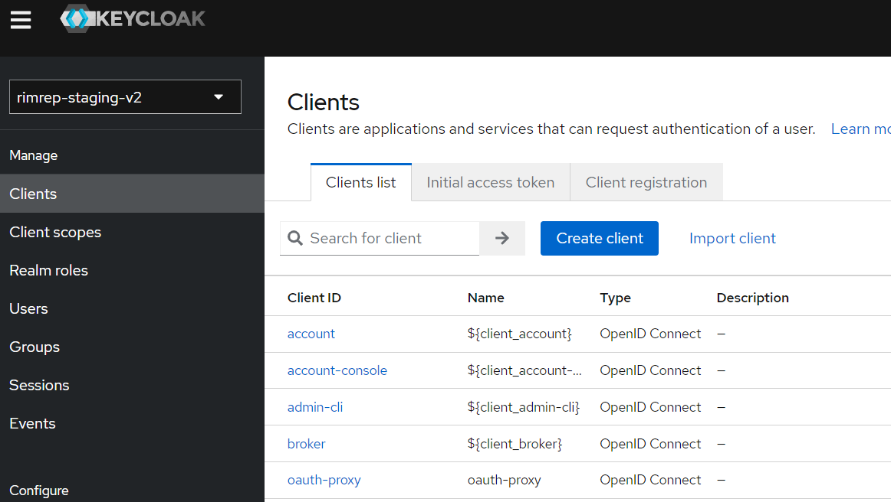

- Select Tab Credentials-->Client Secret-->Click Regenerate
- Tab Credentials-->Registration Access Token-->Click Regenerate  

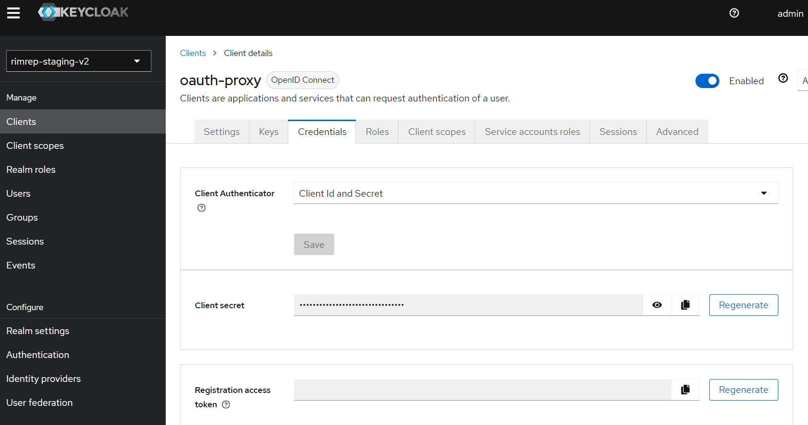

- Once the client id/secrets are reset copy and store in AWS Secrets Manager [Secrets Manual Rotation](#secrets-manual-rotation)

### GitHub Tokens Rotation
Managed by AODN. No one in the RIMReP team is an owner of the `aodn` GitHub organisation.

**Note** there are PATs (personal access tokens) for the following:

- TerraformCloud `rimrep-staging-network` workspace - `github_token` variable. This is used to bootstrap the [`rimrep-flux`](https://github.com/aodn/rimrep-flux) GitHub repository. It is also used by Flux to commit changes.
  - This is using a classic PAT generated by [`rimrep-bot`](https://github.com/rimrep-bot).

- TerraformCloud `rimrep-development-infrastructure` workspace - `github_token` variable. This is used to bootstrap the [`rimrep-flux`](https://github.com/aodn/rimrep-flux) GitHub repository and the [`rimrep-argo-workflow`](https://github.com/aodn/rimrep-argo-workflow) GitHub repository in `development` environment. It is also used by Flux to commit changes.
  - This is using a classic PAT generated by [`rimrep-bot`](https://github.com/rimrep-bot).

### Amazon Secret Manager

#### Secrets Manual Rotation  
- RDS credentials rotation
- Keycloak admin credentials rotation
- Keycloak client id/client secrets rotation

1. Login to [`aws portal`](https://ap-southeast-2.console.aws.amazon.com/secretsmanager/) for secrets rotation
2. Click Secret name
3. In `Overview` tab select `Retrieve secret value`, then click `Edit` to rotate secret vaule (Ex:- New regenerated secrets from keycloak or RDS secrets). 
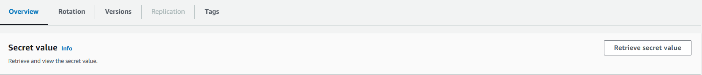

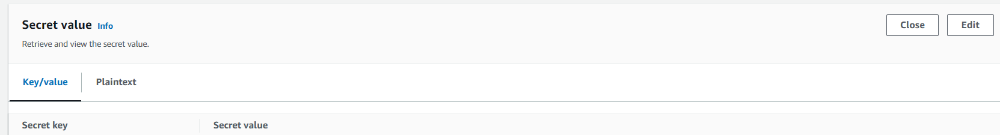

#### Secrets Automatic Rotation

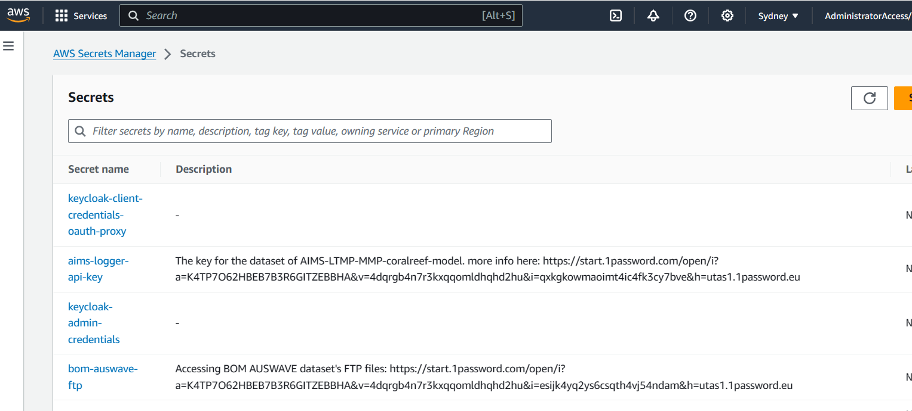

- In Secret details page `Rotation` tab select `Edit rotation` 

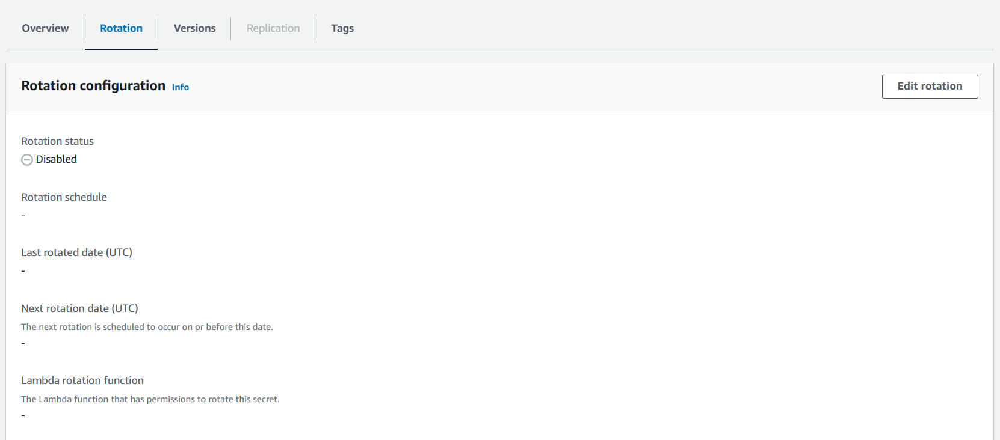

- Configure auto rotation by enabling `Automatic rotation`
- Rotation can be scheduled in hours/days/weeks/months
- Rotation can also be done through `Lambda function`  

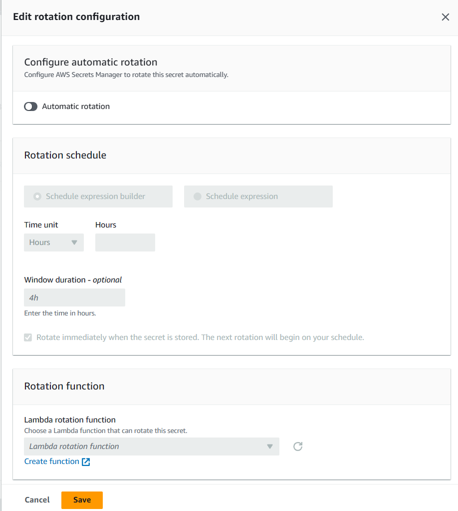

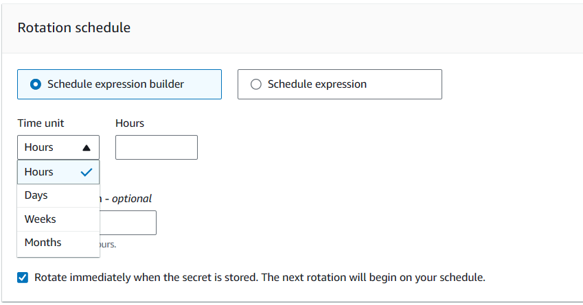

### AWS tokens/secrets (IAM access keys) Rotation
- IAM access keys work as credentials for programmatic access. Credentials should be rotated or changed on a periodic time frame. For this reason it is considered a security best practice to rotate access keys.
- For best practice ensure IAM access keys are rotated every `90 days`
- Login to [`aws portal`](https://us-east-1.console.aws.amazon.com/iam/) for IAM access key rotation
- Select user name, under `Security credentials` tab delete the exisitng keys and create new ones.

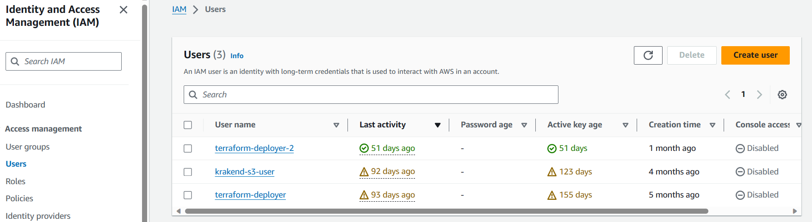
