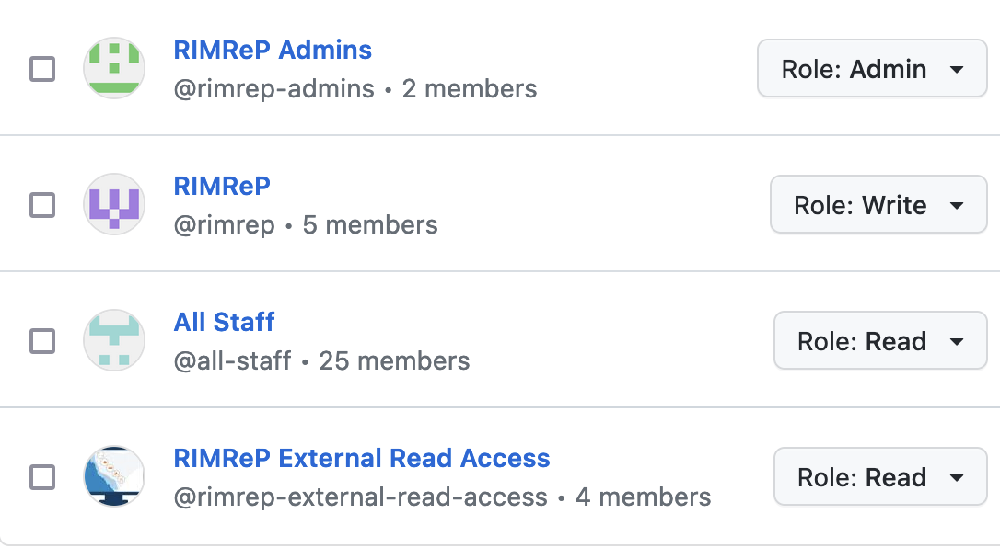

# List of internal tools and services

"Internal" tools and services are those that are used by the DMS team, but not exposed to the public.

This document reflects the current state, not the future or desired state.

External services (running outside our Kubernetes cluster):

- [Slack](#slack)
- [GitHub](#github)
- [AWS](#aws)
- [Okta](#okta)
- [Auth0](#auth0)
- [TerraformCloud](#terraformcloud)

Internal services (running inside our Kubernetes cluster):

- [Argo Workflows](#argo-workflows)
- [Grafana](#grafana)
- [Weave GitOps](#weave-gitops)
- [Keycloak](#keycloak)

## Slack

There is a GBR DMS Slack Workspace (separate to IMOS).

https://rimrepdms.slack.com

### Configuration

Slack is configured manually.

### Access Control

Auth is handled manually by Slack. Eduardo is the owner of the workspace.

## GitHub

All of our code is stored in GitHub in the `aodn` organisation.

See https://github.com/aodn/rimrep-dms for all our repositories

### Configuration

Managed by AODN.

**Note** there are PATs (personal access tokens) for the following:

- TerraformCloud `rimrep-staging-network` workspace - `github_token` variable. This is used to bootstrap the [`rimrep-flux`](https://github.com/aodn/rimrep-flux) GitHub repository. It is also used by Flux to commit changes.
  - This is using a classic PAT generated by [`rimrep-bot`](https://github.com/rimrep-bot).
- TerraformCloud `rimrep-development-infrastructure` workspace - `github_token` variable. This is used to bootstrap the [`rimrep-flux`](https://github.com/aodn/rimrep-flux) GitHub repository and the [`rimrep-argo-workflow`](https://github.com/aodn/rimrep-argo-workflow) GitHub repository in `development` environment. It is also used by Flux to commit changes.
  - This is using a classic PAT generated by [`rimrep-bot`](https://github.com/rimrep-bot).

### Access Control

Auth is handled by GitHub (managed by AODN).

See the following teams, this should be applied to all repositories (unless sensitive):

## AWS

All of our infrastructure is hosted in AWS. Login through Okta SSO link https://sso.aodn.org.au

### Configuration

Root account is managed by AODN. No one in the GBR team is an owner of the root account.

### Access Control

Auth is handled by Okta (managed by AODN). There are 3 accounts/environments: `development`, `staging` and `production`, with two roles `AdministratorAccess` and `ReadOnlyAccess`. All GBR team members have access to both roles in all the environments.

Be wary of the following **IAM users** we have created:

In `staging` and `production`:

- `terraform-deployer` - used by TerraformCloud to deploy infrastructure (for both `staging` and `production` accounts). Uses manually created access key, stored in TerraformCloud `AWS_ACCESS_KEY_ID` and `AWS_SECRET_ACCESS_KEY` variable set.

In `staging`:

- Temporary accounts for GitHub Actions to push Docker images to ECR. Uses manually created access key, stored in GitHub Secrets.
  - `ecr-dashboard-pull-push`
  - `ecr-metcalf-pull-push`
  - `ecr-pygeoapi-pull-push`
  - `ecr-scripts-pull-push`
  - `ecr-stac-browser-pull-push`
  - `ecr-stac-fastapi-pull-push`

-- Update--

We've changed to use IAM roles for `development` environment (The same changes are yet to be applied to `staging` later). 
- `terraform-deployer` IAM role - used by TerraformCloud to deploy infrastructure for `development` account.
- The following IAM roles were created for GitHub Actions to push Docker images to `development` ECR. 
  - `ecr-dashboard-policy-federated`
  - `ecr-krakend-plugin-policy-federated`
  - `ecr-metcalf-policy-federated`
  - `ecr-pygeoapi-policy-federated`
  - `ecr-scripts-policy-federated`
  - `ecr-stac-browser-policy-federated`
  - `ecr-stac-fastapi-policy-federated`

  Github Actions for different repositories are in the process of being updated to use the IAM roles to access `development` ECR. Track the progress [here](https://github.com/aodn/rimrep-dms/issues/250).

## Okta

https://sso.aodn.org.au

Okta is used for authentication to AWS, Notion, Argo Workflows and Grafana.

### Configuration

Managed by AODN.

### Access Control

Auth is handled by AODN.

## Auth0

Auth0 is used in `staging` environment for authentication  to our external services - ie pygeoapi, stac-fastapi, stac-browser, rimrep-dms-dashboard, ...

We have a single `staging-reefdata` tenant setup - https://manage.auth0.com/dashboard/au/staging-reefdata

See [Auth architecture](../architecture/components/auth.md)

### Configuration

Most Auth0 configuration (including external users) is setup via Terraform. (See [`rimrep-terraform/staging/infrastructure/auth0.tf`](https://github.com/aodn/rimrep-terraform/blob/main/staging/infrastructure/auth0.tf)).

Some configuration - like login screen branding - is done manually through the [Auth0 manage dashboard](https://manage.auth0.com/dashboard/au/staging-reefdata).

### Access Control

Auth (for "internal" users) is handled manually by Auth0. Admin "team members" can be added to each tenant (for example `staging-reefdata`) in the [Auth0 manage dashboard](https://manage.auth0.com/dashboard/au/staging-reefdata).

Eduardo, Michaela and Julia are `admin`.

## Keycloak

A new Auth solution using `keycloak` and `KrakenD API Gateway` is being implemented in `development` environment.

More details to be added later.

## TerraformCloud

TerraformCloud is used to manage our infrastructure, it will "plan" and "apply" our Terraform IaC (Infrastructure as Code) stored in [`rimrep-terraform`](https://github.com/aodn/rimrep-terraform)

https://app.terraform.io/app

### Configuration

TerraformCloud setup is done manually. There are secrets manually stored in the TerraformCloud workspaces. See notes on AWS and GitHub Access Control

### Access Control

Authentication is handled manually by TerraformCloud. There are two groups: `owners` and `maintainers` (write to `staging` and plan only to `production`).

Eduardo and Julia are in the `owner` team, and Leo is in the `maintainers` team.

## Argo Workflows

Our workflow engine is Argo Workflows.

https://argo.staging.reefdata.io

### Configuration

Running in k8s, configuration is split between [`rimrep-terraform`](https://github.com/aodn/rimrep-terraform) and [`rimrep-flux`](https://github.com/aodn/rimrep-flux) repos.

Note: RBAC is not enabled in Argo Workflows. This means that all users can do anything.

All workflows are managed in the [`rimrep-argo-workflow`](https://github.com/aodn/rimrep-argo-workflow) repository.

### Access Control

Authentication is handled by Okta (managed by AODN). **All users** can login to Argo Workflows.

## Grafana

Logging and monitoring of resources inside our cluster is done via Grafana.

https://grafana.staging.reefdata.io

### Configuration

Running in k8s, configuration is split between [`rimrep-terraform`](https://github.com/aodn/rimrep-terraform) and [`rimrep-flux`](https://github.com/aodn/rimrep-flux) repos.

### Access Control

Authentication is handled by Okta (managed by AODN). Limited to `utas.edu.au` domain, and `RIMReP_Admin, RIMReP` groups

## Weave GitOps

Weave GitOps provides a frontend to Flux.

### Configuration

Running in k8s, configuration is split between [`rimrep-terraform`](https://github.com/aodn/rimrep-terraform) and [`rimrep-flux`](https://github.com/aodn/rimrep-flux) repos.

### Access Control

Service is not exposed to the internet - only accessible from within the k8s cluster (via port forwarding).
There is a hardcoded `admin` username/password in the project shared [1Password vault](https://start.1password.com/open/i?a=K4TP7O62HBEB7B3R6GITZEBBHA&v=4dqrgb4n7r3kxqqomldhqhd2hu&i=lzhdqev2ekghugscgrjwpdxaqm&h=utas1.1password.eu).
